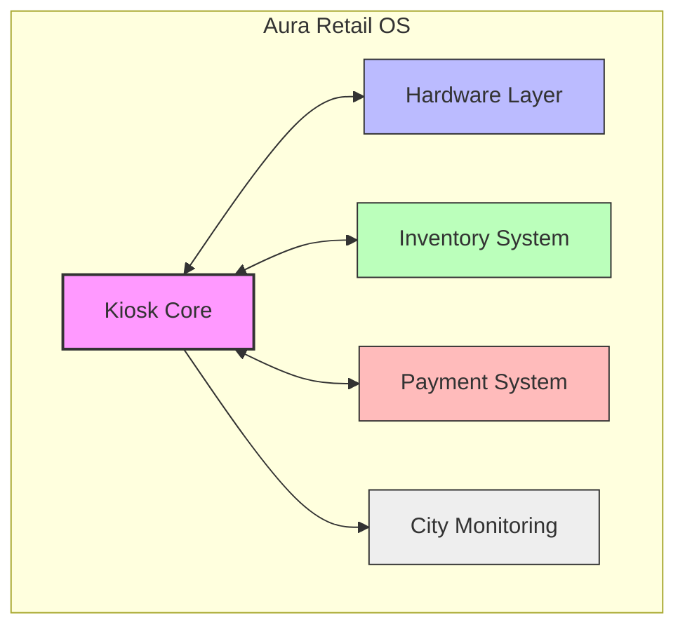

# 🌌 Aura Retail OS

> **Modular, OOP-driven Autonomous Retail Kiosk System**
>
> Aura Retail OS is a state-of-the-art software platform designed for the next generation of autonomous retail kiosks. Built with a focus on **Path B (Modular Hardware Platform)**, it enables dynamic hardware integration, unified payment processing, and hierarchical inventory management through rigorous application of Object-Oriented Programming principles.

--

## 🚀 Project Overview

The Aura Retail OS treats the kiosk as a **long-term hardware platform**. Our architecture addresses the critical failures of monolithic systems by prioritizing:
- **Scalability**: Swapping hardware implementations without touching high-level logic.
- **Flexibility**: Attaching new hardware modules (Refrigeration, Solar, Network) at runtime.
- **Reliability**: Atomic transactions with full rollback support.
- **Security**: Hierarchical access control for all inventory and hardware operations.

--

## 🏗️ Core Architecture

The system is divided into five specialized subsystems, communicating through strict interface contracts:



1.  **Kiosk Core**: Manages state transitions, command execution, and the primary facade.
2.  **Hardware Layer**: Abstraction for dispensers and optional environmental modules.
3.  **Inventory System**: Handles products and nested product bundles (Composite).
4.  **Payment System**: Unifies diverse 3rd-party APIs through a common adapter.
5.  **City Monitoring**: Event-driven observation for maintenance and supply chain logistics.

--

## 🛠️ Getting Started

### Backend Setup (Java 17 + Maven)

1. **Compile the project**:
   ```bash
   mvn clean compile
   ```

2. **Run the API Server**:
   ```bash
   mvn exec:java -Dexec.mainClass="aura.ApiServer"
   ```
   *The server will start at `http://localhost:8080`.*

### Frontend Dashboard (React + Vite)

1. **Navigate to the frontend directory**:
   ```bash
   cd frontend
   ```

2. **Install dependencies**:
   ```bash
   npm install
   ```

3. **Start the development server**:
   ```bash
   npm run dev
   ```

--

## 🧪 Simulation Scenarios

The project includes predefined simulation scenarios highlighting the core architecture:

### 🔹 Scenario A: Modular Hardware
Demonstrates dynamically adding hardware modules (Refrigeration and Solar) via the **Decorator** pattern and swapping dispenser implementations at runtime via the **Bridge** pattern.
```bash
mvn exec:java -Dexec.mainClass="aura.simulation.ScenarioA_NewHardwareModule"
```

### 🔹 Scenario B: Payment Integration
Showcases the **Adapter** pattern by registering a new third-party payment provider (Crypto) at runtime without modifying existing core logic.
```bash
mvn exec:java -Dexec.mainClass="aura.simulation.ScenarioB_NewPaymentProvider"
```

### 🔹 Scenario C: Nested Bundles
Demonstrates the **Composite** pattern by creating deep inventory hierarchies (e.g., Med Kit inside an Emergency Kit) and propagating stock/discount attributes.
```bash
mvn exec:java -Dexec.mainClass="aura.simulation.ScenarioC_NestedBundles"
```

### 🔹 Full System Demo
Runs an end-to-end integration demo showcasing transactions, state transitions, and error handling.
```bash
mvn exec:java -Dexec.mainClass="aura.simulation.SubTask2Demo"
```

--